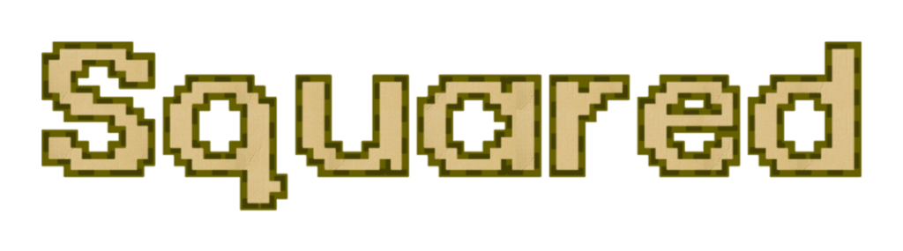

VERY strictly typed, interpretd lang, similar to python. has a parent-child system, object system, and allows for mods to be made for the engine.
/n check out the project here https://websim.com/@sarge/squared-2-ide
